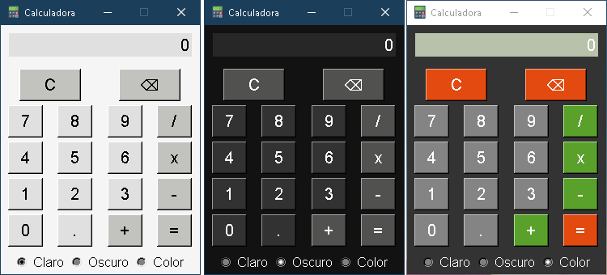

# Calculadora en Python con Tkinter

Esta es una calculadora interactiva simple desarrollada en Python utilizando la biblioteca Tkinter para la interfaz gráfica. La calculadora admite operaciones básicas como suma, resta, multiplicación y división, así como la capacidad de borrar dígitos y realizar cálculos a través del teclado. Además, cuenta con una opción de cambio de tema, permitiéndote seleccionar entre temas de color, oscuro y claro para personalizar la apariencia de la calculadora según tus preferencias.

## Screenshots

